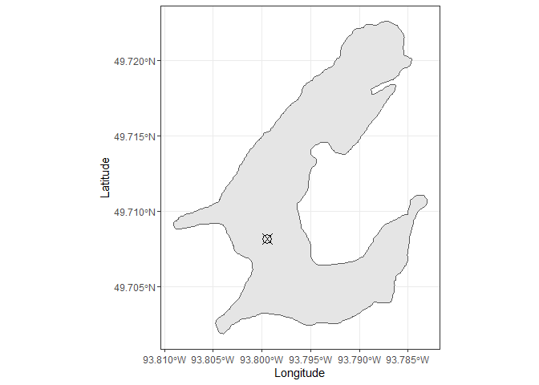

<!-- README.md is generated from README.Rmd. Please edit that file -->

# elaacoustics

Analytical Tools for ILK’s ELA Acoustic Surveys

<!-- badges: start -->


<!-- badges: end -->

## Installation

This package is not available at this time on CRAN. You can install
`elaacoustics` from the GitHub repository using
`devtools::install_github()`.

``` r
devtools::install_github("HoldenJe/elaacoustics")
```

## Plotting Examples

This is an example of how to use the basemaps for each lake.

``` r
library(elaacoustics)
library(ggplot2)
basemap_lake379
```


This is an example of how to add a point to the basemap of the lake.

``` r
basemap_lake379 + 
  geom_point(aes(x = -93.799462, y = 49.708170), pch = 13, size = 4) +
  theme_bw() +
  ylab("Latitude") + xlab("Longitude")
```



This is an example of how to combine multiple lake files on a single
plot and add customization.

``` r
ggplot()+ 
  geom_sf(data = shape_lake379, fill = 'blue') + 
  geom_sf(data = shape_lake259, fill = 'blue') +
  geom_point(aes(x = -93.799462, y = 49.708170), pch = 13, size = 4, colour = "yellow") +
  theme_bw() +
  ylab("Latitude") + xlab("Longitude") +
  theme(axis.text.x = element_text(angle = 45, hjust = 1))
```


## Exporting Data

Functions used for exporting data from [Echoview](https://echoview.com/)
require:

1.  A valid [Echoview](https://echoview.com/) license with automation
    module.  
2.  `RDCOMClient`installed. If `RDCOMClient` failed to install when
    `erieacoustics` was installed please review installation
    instructions on [RDCOMCLient Github
    page](https://github.com/omegahat/RDCOMClient).

### Primary Exports for Analysis

It is expected that the survey has been processed using the appropriate
file structure and analysis template and the following tasks have been
completed:  
1. Detected bottom line has been edited to appropriately fit bottom  
2. Bad data regions have been identified (within transect as well as
off-transect areas)  
3. Fish track detection has been completed and manually inspected to
verify that only valid fish tracks remain  
4. If required, *NearSurfaceExclusion* and *Thermocline* lines have
adjusted within the data file  
It is not required that the *Survey* analysis region be created manually
as the function will automatically create the necessary line relative
region prior to export.
